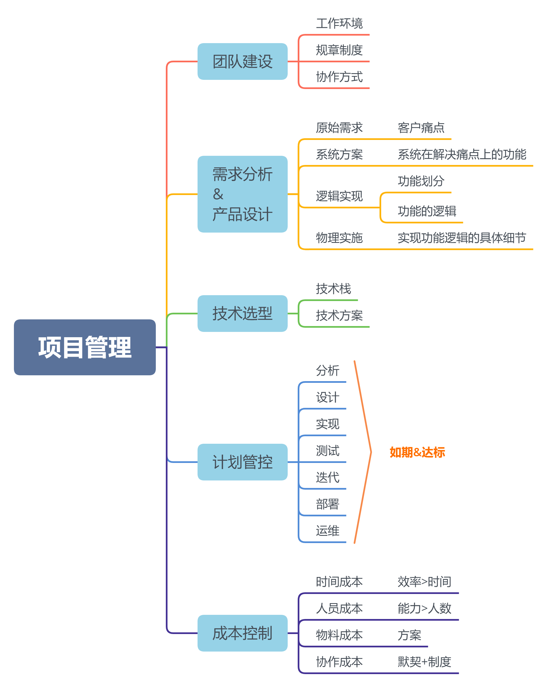

#### 个人资料

- **孙超**，男，**1989年4月**出生在**日照莒县**。2013年毕业于 **济宁学院** **计算机科学与技术** 专业，本科学历。

- 联系方式：

  - 电话：15065479650
  - 邮箱：[qfsz168@qq.com](mailto:qfsz168@163.com)
  - 微信：qfsz168
  - GitHub：[qfsz168](https://gitee.com/qfsz168/)
  - 博客：[走在编程路上](https://www.qfsz168.top/)

- 简介：
  - 2014年至今，有7年软件开发工作经验，擅长java、php、mysql设计开发，以及前端开发
  - 推崇大道至简，擅长用最简单的设计、逻辑、编码去解决实际问题。
  - 追求高收益投入比，善于通过充分评估、分析、设计、计划和实施，提高效率，降低投入，进而使收益最大化。

------

#### 个人履历

- 2008.09--2013.06：就读济宁学院计算机科学与技术专业
- 2012.02--2014.02：经营电脑维修的门店
- 2014.04--2016.03：就职于 山东蓝果科技有限公司 任 PHP工程师
- 2016.04--2019.04：就职于 北京融美科技有限公司 任 PHP部门经理、前端部门经理
  - 
- 2019.04--今：就职于 山东可达鸭教育科技有限公司 任 后端工程师

------

#### 项目&领域

**电商品台**
熟悉电商平台的各个环节，遇到并排除过秒杀等环节出现的诸如高并发、超卖、支付等问题。
做过一元购、秒杀、普通购物等类型的电商平台项目。

**资源管理**
类似于网盘的各类文件资源管理
包括各类型的视频、音频、文档等资源的转码和预览。
上传队列，断点续传，秒传等，还有lvs，tp5，webscket，srs，linux等技术。

**金融领域**
众筹、撮合交易、票据交易、股票配资 等金融系统。
熟悉电子钱包、资金流、各类支付平台的对接等业务。

**教培领域**
涉及 课程、班级、排课、课消、收费、学员、教职工、部门、资源（文件，物品等）管理

**音视频直播点播**
在线课堂、双师课堂、视频点播、互动直播等方面。
熟悉 SRS，WebRtc，Rtmp等相关的技术和协议。

------
#### 技能概述

###### 项目管理

- 能独立完成需求分析、产品设计、项目开发、后期维护等全栈工作。
- 有带领团队，协调成员高校协作，进行技术培训的经验。
- 项目架构，技术选型，风险评估，成本把控，质量把控等均可独立完成。

###### JAVA、PHP、Mysql

- 5年PHP Web开发经验，熟悉ThinkPHP。
- 2年JAVA Web开发经验，熟练使用Springboot、Mybatis等。
- 7年Mysql经验，能设计编写和调优SQL语句。

###### 其他

- 熟悉Web前端的开发技术。
- 有基于HBuilder或APICloud的混编开发的经验。
- 熟悉linux系统、会写shell程序。
- 熟悉 禅道、Git、showdoc等项目工具服务的搭建和使用。

------
#### 技术储备

- 熟悉 Websocket、http、TCP协议，对数据结构和算法，计算机原理和操作系统等学科有了解
- 熟悉 ThinkPHP、Workerman、Swoole等PHP开发框架
- 熟悉 Springboot、Mybatis等java开发框架
- 熟悉 php、java和mysql等开发环境的搭建和维护，能进行nginx、apache等web服务器的部署和调优
- 熟悉 本地和阿里等云服务器的部署和维护，了解liunx的基本命令，长期使用基于linux的centos、ubuntu、deepin系统
- 有直播点播系统开发经验，熟悉nginx-rtmp、SRS等服务
- 了解 redis、memcache缓存
- 熟悉Html、Js、Css，Vue，Jquery、Bootstrap、ElementUI等技术框架，会用HBuilder和APICloud进行混编开发，有微信公众号、H5终端的开发经验

------
#### 自我评价

- 热爱计算机技术，渴望掌握新的技能和理论，从未停止学习。
- 除了编程技能的积淀，还实科关注项目管理的技能，有两年项目和团队的管理经验。
- 注重项目的质量和周期时长的把控，注重降低项目成本。
- 能快速学习。一周时间边学边用vue和tp5，两周时间自学java并开始实际的开发。
- 有良好的职业素养和契约精神。
- 记过几年的工作积累，感觉技术是学不完的的，需要保持学习的动力和能力；但是编程的思想和精髓是有限的，掌握这些，即可以不变应万变。
- 能提出建设性意见和方案(如采用前后端分离，采用混编开发，直接节省了两个工作岗位)。

------
#### 求职意向

项目经理**(可从开发做起)

工作状态：在职，考虑新机会

到岗时间：1个月以内(应该一周左右)

期望待遇：12K+ ; 双休；工资按时发放；
**接受加班，常态化除外（996请勿扰）**；

#### 附:
- 自己总结的项目管理体系：
